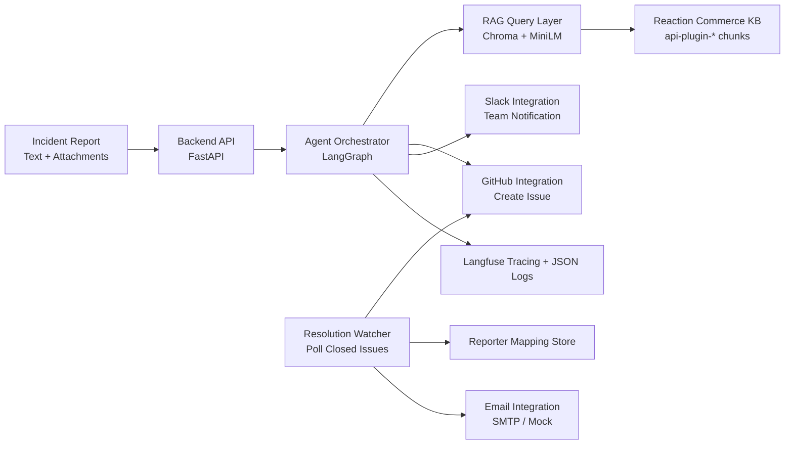

# ScoutOps - SRE Incident Triage Agent

ScoutOps is an end-to-end incident triage system for e-commerce operations that converts raw reports (text, logs, screenshots) into actionable engineering work: it performs retrieval-augmented diagnosis over the Reaction Commerce monorepo, generates structured triage output, opens a GitHub Issue, alerts the team in Slack, and later notifies the original reporter when the issue is resolved.

## Architecture



## Tech Stack

| Component | Technology | Reason |
|---|---|---|
| API service | FastAPI | Lightweight, typed backend with async support |
| Agent pipeline | LangGraph + Gemini | Multi-node triage orchestration |
| Retrieval layer | ChromaDB | Fast local persistent vector search |
| Embeddings | sentence-transformers all-MiniLM-L6-v2 | Efficient semantic code retrieval |
| Knowledge base | Reaction Commerce monorepo | Real e-commerce architecture and plugin logic |
| Ticketing | GitHub Issues API | Hackathon-friendly, simple workflow tracking |
| Team notifications | Slack Webhooks (Block Kit) | Low-friction incident broadcast |
| Reporter notifications | SMTP via aiosmtplib | Async, provider-agnostic email delivery |
| Observability | Langfuse + python-json-logger | Traces for nodes and structured logs |
| Runtime | Docker Compose | Reproducible local deployment |

## Setup

1. Clone the repository.
2. Create environment file:

```bash
cp .env.example .env
```

3. Fill all required keys in `.env` (Gemini, GitHub, Slack, SMTP, Langfuse).
4. Build and run services:

```bash
docker compose up --build
```

## Run RAG Ingestion

Run this once after setting `REACTION_COMMERCE_REPO_PATH` (or leave it empty to auto-clone into `./data/reaction_commerce`):

```bash
python rag/ingest_repo.py
```

The script will parse every `packages/api-plugin-*` plugin, chunk files, embed chunks, and persist them in the `reaction_commerce` Chroma collection.

## Folder Structure Overview

```text
ScoutOps/
├── agent/
├── apps/
│   └── backend/
│       └── app/
│           └── services/
│               ├── agent_service.py
│               └── resolution_watcher.py
├── integrations/
│   ├── github.py
│   ├── slack.py
│   └── email.py
├── observability/
│   ├── logs.py
│   └── tracing.py
├── rag/
│   ├── ingest_repo.py
│   ├── vector_store.py
│   ├── embeddings.py
│   └── queries.py
├── docker-compose.yml
├── .env.example
├── QUICKGUIDE.md
├── SCALING.md
└── AGENTS_USE.md
```

## Hackathon Goal

This implementation is optimized for AgentX Hackathon 2026 delivery: fast setup, practical reliability controls, and clear upgrade paths for production-scale operations.
