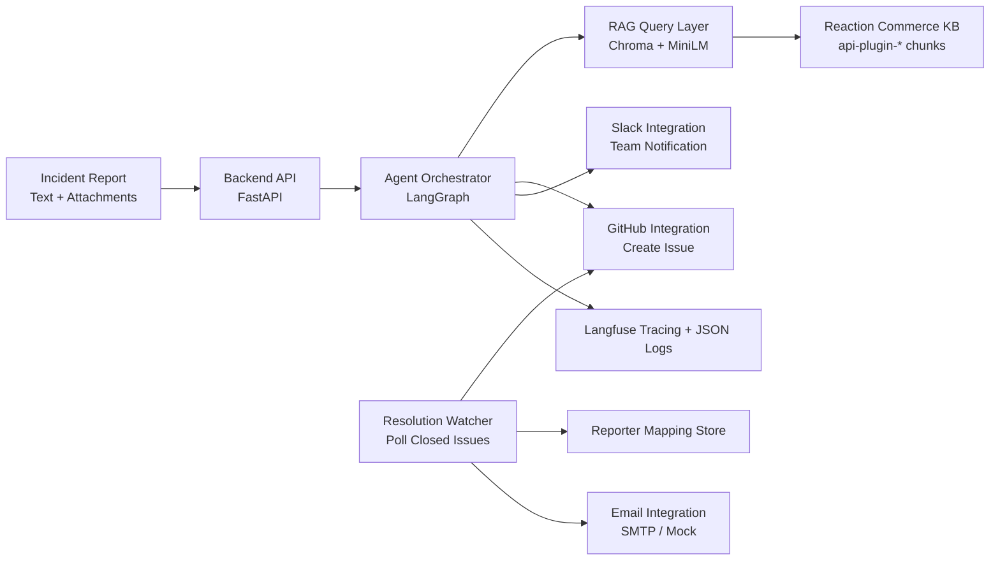

# ScoutOps - SRE Incident Triage Agent

ScoutOps is an end-to-end incident triage system for e-commerce operations that converts raw reports (text, logs, screenshots) into actionable engineering work: it performs retrieval-augmented diagnosis over the Reaction Commerce monorepo, generates structured triage output, opens a GitHub Issue, alerts the team in Slack, and later notifies the original reporter when the issue is resolved.

## Architecture



## Agent Pipeline

The triage pipeline runs as a LangGraph `StateGraph` with 6 sequential nodes. Each node is independently traced via `@trace_node` (Langfuse) and logs structured JSON on completion.

```
Input: { description, source, attachment? }
  │
  ▼
[1] classify_node        → incident_type: checkout_failure | login_error | catalog_issue | ...
  │
  ▼
[2] extract_node         → entities: affected_service, feature, error_patterns, user_impact
  │
  ▼
[3] retrieve_node        → rag_context: top-5 Reaction Commerce code chunks by cosine similarity
  │                        side-effect: sets entities.affected_file from best RAG hit
  ▼
[4] attachments_node     → attachment_analysis: Gemini Vision (images) or structured LLM (logs)
  │                        skipped if no attachment provided
  ▼
[5] summarize_node       → technical_summary: synthesizes description + RAG context + attachment
  │
  ▼
[6] route_node           → severity (P1/P2/P3) + assigned_team + affected_plugin + layer
                           hybrid_confidence = (llm_confidence × 0.6) + (rag_relevance × 0.4)
                           if confidence < 0.70 → escalated_human (no ticket created)

Output: TriageResult JSON
```

> **Design note — Severity assignment:** Severity is determined inside `route_node` alongside team routing. This is intentional: severity depends on the same LLM call that assigns the team and plugin, avoiding a redundant LLM invocation and reducing end-to-end latency by ~1–2 seconds. Both decisions share context and are produced atomically.

## Input Explainability

When multiple signals are present, the agent prioritizes them as follows:

1. **Attachment (log/image)** — highest signal fidelity. Error codes and stack traces extracted by `attachments_node` and injected verbatim into the summarize prompt.
2. **RAG codebase context** — `retrieve_node` maps the incident to exact plugin files via semantic search. Top relevance score contributes 40% of the hybrid confidence.
3. **Free-text description** — used by `classify_node` and `extract_node` for incident type and entity extraction.

If an attachment shows `CPU 100%` but the text mentions `Timeout`, the summarize prompt receives both signals and the LLM explains the prioritization in the generated technical summary. The `confidence_score` field in the output reflects how well all signals agree.

## Governance Controls

| Control | Implementation |
|---|---|
| Confidence threshold | `route_node` computes hybrid confidence; if < 0.70 → no ticket, Slack escalation alert |
| Human-in-the-loop | Frontend shows amber banner; Slack sends `⚠️ HUMAN REVIEW REQUIRED` Block Kit message |
| Prompt injection guard | `guardrails.py` blocks 9 pattern classes before any LLM call |
| Input sanitization | Control chars stripped, whitespace collapsed in `sanitize_text()` |
| Deduplication | `notified_issues.json` ensures exactly-once email per resolved ticket |

## Tech Stack

| Component | Technology | Reason |
|---|---|---|
| API service | FastAPI | Lightweight, typed backend with async support |
| Agent pipeline | LangGraph + Gemini | Multi-node triage orchestration |
| Retrieval layer | ChromaDB | Fast local persistent vector search |
| Embeddings | sentence-transformers all-MiniLM-L6-v2 | Efficient semantic code retrieval |
| Knowledge base | Reaction Commerce monorepo | Real e-commerce architecture and plugin logic |
| Ticketing | GitHub Issues API | Hackathon-friendly, simple workflow tracking |
| Team notifications | Slack Webhooks (Block Kit) | Low-friction incident broadcast |
| Reporter notifications | SMTP via aiosmtplib | Async, provider-agnostic email delivery |
| Observability | Langfuse + python-json-logger | Traces for nodes and structured logs |
| Runtime | Docker Compose | Reproducible local deployment |

## Setup

1. Clone the repository.
2. Create environment file:

```bash
cp .env.example .env
```

3. Fill all required keys in `.env` (Gemini, GitHub, Slack, SMTP, Langfuse).
4. Build and run services:

```bash
docker compose up --build
```

## Run RAG Ingestion

Run this once after setting `REACTION_COMMERCE_REPO_PATH` (or leave it empty to auto-clone into `./data/reaction_commerce`):

```bash
python rag/ingest_repo.py
```

The script will parse every `packages/api-plugin-*` plugin, chunk files, embed chunks, and persist them in the `reaction_commerce` Chroma collection.

## Folder Structure Overview

```text
ScoutOps/
├── agent/
├── apps/
│   └── backend/
│       └── app/
│           └── services/
│               ├── agent_service.py
│               └── resolution_watcher.py
├── integrations/
│   ├── github.py
│   ├── slack.py
│   └── email.py
├── observability/
│   ├── logs.py
│   └── tracing.py
├── rag/
│   ├── ingest_repo.py
│   ├── vector_store.py
│   ├── embeddings.py
│   └── queries.py
├── docker-compose.yml
├── .env.example
├── QUICKGUIDE.md
├── SCALING.md
└── AGENTS_USE.md
```

## Hackathon Goal

This implementation is optimized for AgentX Hackathon 2026 delivery: fast setup, practical reliability controls, and clear upgrade paths for production-scale operations.
