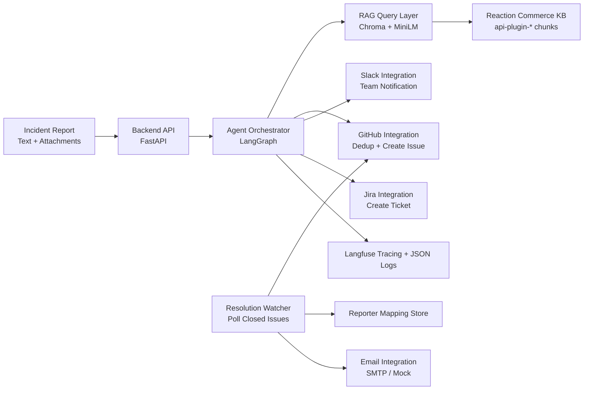

# ScoutOps — SRE Incident Triage Agent

ScoutOps is an end-to-end incident triage system for e-commerce operations that converts raw reports (text, logs, screenshots) into actionable engineering work: it performs retrieval-augmented diagnosis over the Reaction Commerce monorepo, generates structured triage output, opens a GitHub Issue and a Jira ticket, alerts the team in Slack, deduplicates repeat incidents, and notifies the original reporter when the issue is resolved.

## Architecture



## Agent Pipeline

The triage pipeline runs as a LangGraph `StateGraph` with 6 sequential nodes. Each node is independently traced via `@trace_node` (Langfuse) and logs structured JSON on completion.

```
Input: { description, source, attachment? }
  │
  ▼
[1] classify_node        → incident_type: checkout_failure | login_error | catalog_issue | ...
  │                        classification_confidence < 0.35 → vague_input=True (short-circuits to escalation)
  ▼
[2] extract_node         → entities: affected_service, feature, error_patterns, user_impact
  │
  ▼
[3] retrieve_node        → rag_context: top-5 Reaction Commerce code chunks by cosine similarity (1 - d²/2)
  │                        side-effect: sets entities.affected_file from best RAG hit
  ▼
[4] attachments_node     → attachment_analysis: Gemini Vision (images) or structured LLM (logs)
  │                        skipped if no attachment provided
  ▼
[5] summarize_node       → technical_summary: synthesizes description + RAG context + attachment
  │
  ▼
[6] route_node           → severity (P1/P2/P3) + assigned_team + affected_plugin + layer
                           hybrid_confidence = (llm × 0.7) + (rag_relevance × 0.3)  [if RAG results]
                           hybrid_confidence = llm_confidence                         [if no RAG results]
                           if confidence ≤ 0.70 → escalated_human (no ticket created)
                           if confidence > 0.70 → dedup check → GitHub Issue + Jira ticket

Output: TriageResult JSON
```

> **Design note — Severity assignment:** Severity is determined inside `route_node` alongside team routing. This avoids a redundant LLM invocation and reduces latency by ~1–2 s. Both decisions share context and are produced atomically.

## Input Explainability

When multiple signals are present, the agent prioritizes them in this order:

1. **Attachment (log/image)** — highest fidelity. Error codes and stack traces extracted by `attachments_node` and injected verbatim into the summarize prompt.
2. **RAG codebase context** — `retrieve_node` maps the incident to exact plugin files via semantic search. Top relevance score contributes 30% of the hybrid confidence.
3. **Free-text description** — used by `classify_node` and `extract_node` for incident type and entity extraction.

The `confidence_score` field in the output reflects how well all signals agree. If signals conflict (e.g., attachment says `CPU 100%` but description mentions `Timeout`), both are injected into the summarize prompt and the LLM reconciles them explicitly.

## Governance Controls

| Control | Implementation |
|---|---|
| Vague input filter | `classify_node` sets `vague_input=True` when `classification_confidence < 0.35`; `route_node` short-circuits to escalation without further LLM calls |
| Confidence threshold | `route_node` hybrid confidence ≤ 0.70 → no ticket created, Slack escalation alert sent |
| Human-in-the-loop | Frontend shows escalation card; Slack sends `⚠️ HUMAN REVIEW REQUIRED` Block Kit message |
| GitHub deduplication | Before creating a ticket, `search_similar_issues()` checks for open issues with matching `incident_type` + `affected_plugin`; if found, adds a comment instead of opening a new issue |
| Prompt injection guard | `guardrails.py` blocks 9 pattern classes before any LLM call; raises `GuardrailViolationError` → HTTP 400 |
| Input sanitization | Control chars stripped, whitespace collapsed in `sanitize_text()` before any LLM call |
| Notification deduplication | `notified_issues.json` ensures exactly-once email per resolved ticket |
| Frontend guard | Submit button disabled when `POST /validate-input` returns `is_valid: false` |

## Tech Stack

| Component | Technology | Reason |
|---|---|---|
| API service | FastAPI | Lightweight, typed backend with async support |
| Agent pipeline | LangGraph + Gemini 2.5 Flash | Multi-node triage orchestration with structured output |
| Retrieval layer | ChromaDB | Fast local persistent vector search |
| Embeddings | sentence-transformers all-MiniLM-L6-v2 | Efficient semantic code retrieval |
| Knowledge base | Reaction Commerce monorepo | Real e-commerce architecture and plugin logic |
| Ticketing | GitHub Issues API + Jira REST API | Issue tracking + enterprise workflow integration |
| Team notifications | Slack Webhooks (Block Kit) | Low-friction incident broadcast with per-team routing |
| Reporter notifications | SMTP via aiosmtplib | Async, provider-agnostic email delivery |
| Observability | Langfuse + structlog (JSON) | Per-node traces and structured logs |
| Frontend | Next.js 14 + Tailwind CSS | Incident form + real-time status polling |
| Runtime | Docker Compose | Reproducible local deployment |

## Quick Start

See **[QUICKGUIDE.md](QUICKGUIDE.md)** for full step-by-step instructions including:
- Environment variable setup (all required and optional keys)
- RAG ingestion
- Testing the full flow, escalation, deduplication, and resolution notification via UI and cURL

Minimum steps:

```bash
cp .env.example .env        # fill in GEMINI_API_KEY, GITHUB_TOKEN, GITHUB_REPO, SLACK_WEBHOOK_URL
pip install -r requirements.txt
python rag/ingest_repo.py   # index Reaction Commerce codebase into Chroma
docker compose up --build   # frontend :3000  backend :8000  chroma :8001
```

## Folder Structure

```text
ScoutOps/
├── agent/                        # LangGraph pipeline
│   ├── nodes/                    #   classify, extract, retrieve, attachments, summarize, route
│   ├── prompts/                  #   .txt prompt templates per node
│   └── graph.py                  #   StateGraph definition
├── apps/
│   ├── backend/                  # FastAPI backend
│   │   └── app/
│   │       ├── services/         #   agent_service.py, resolution_watcher.py
│   │       ├── schemas/          #   Pydantic models
│   │       └── main.py           #   API endpoints
│   └── frontend/                 # Next.js 14 frontend
│       └── src/
│           ├── app/              #   page.tsx (main view)
│           └── components/       #   ReportForm, ResultView, TicketStatus
├── integrations/                 # GitHub, Jira, Slack, Email
├── observability/                # Langfuse tracing, structlog
├── rag/                          # Chroma ingestion and query
├── docker-compose.yml
├── .env.example
├── QUICKGUIDE.md                 # Step-by-step run & test guide
├── SCALING.md                    # Scaling analysis and bottlenecks
└── AGENTS_USE.md                 # Agent documentation (hackathon submission)
```

## Hackathon Goal

Built for **AgentX Hackathon 2026**. Optimized for fast setup, practical reliability controls (confidence threshold, deduplication, escalation), and clear upgrade paths to production-scale operations documented in `SCALING.md`.
